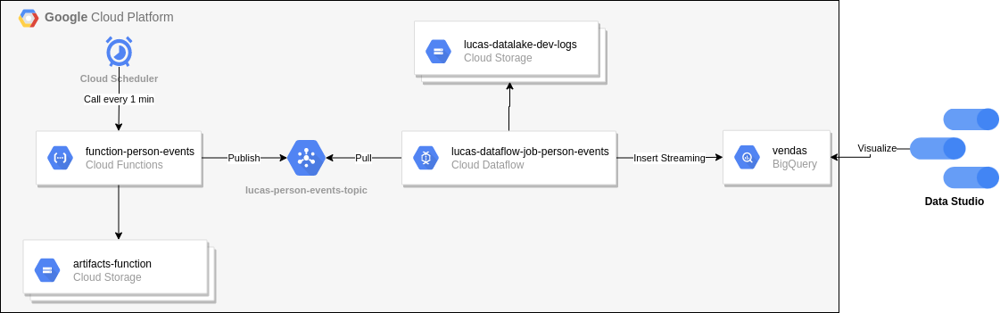
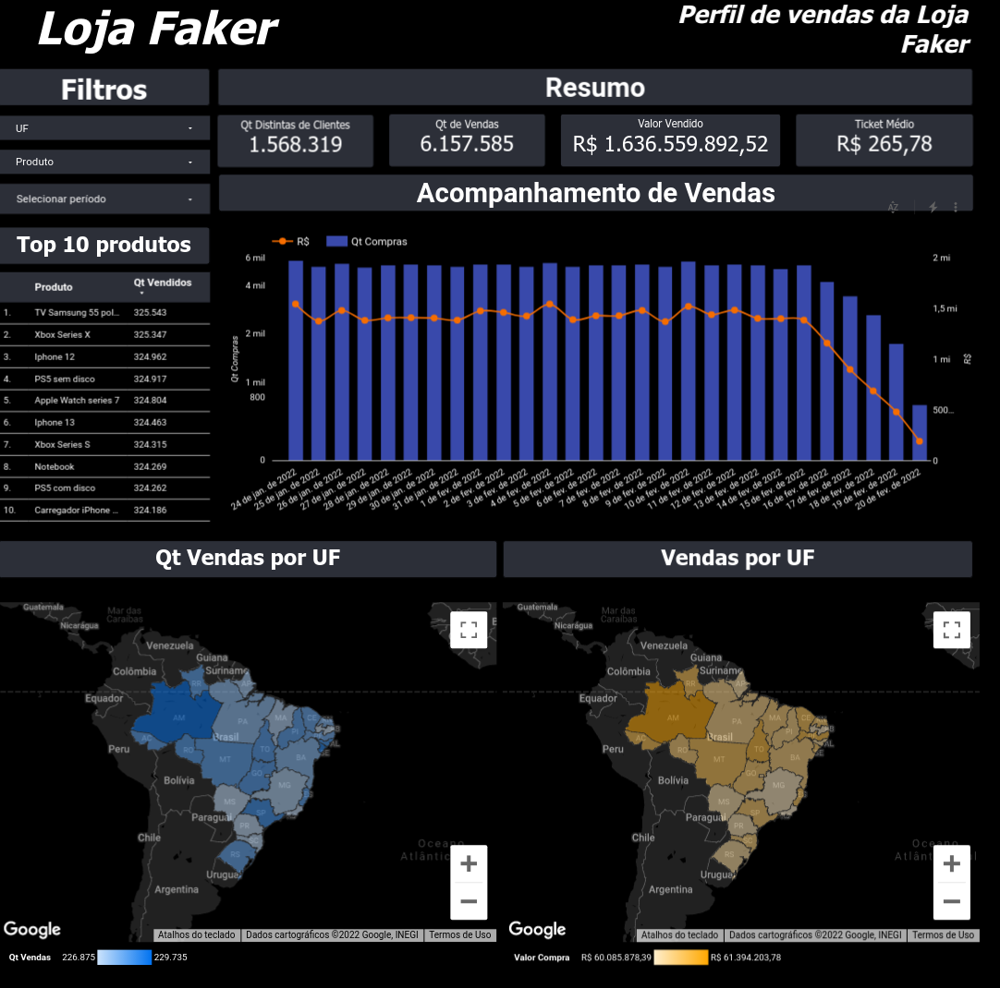

[![Py][python-image]][python-url]
# Loja Faker
O projeto tem como objetivo simular um ambiente de processamento de dados em near-realtime utilizando os principais serviços da Google Cloud(GCP).

## Requisitos/Conhecimentos:
- [Free Tier GCP](https://cloud.google.com/)
- [Python 3.x](https://www.python.org/)
- [Big Query](https://cloud.google.com/bigquery)
- [GCloud](https://cloud.google.com/sdk/install)
- [Terraform](https://registry.terraform.io/providers/hashicorp/google/latest/docs)
- [Cloud Scheduler](https://cloud.google.com/scheduler/docs/schedule-run-cron-job)
- [Cloud Storage](https://cloud.google.com/storage/docs)
- [Cloud Function](https://cloud.google.com/functions/docs/quickstart-console)
- [Data Flow](https://cloud.google.com/dataflow/docs)

# Arquitetura
A arquitetura utilizada neste projeto foi simulando vendas de produtos Fake de uma Loja e sendo feito uma analise em tempo real utilizando o Data Studio como ferramenta de visualização de dados.
O fluxo inicia pelo Cloud Scheduler que a cada 1 minuto realiza uma chamada HTTP Post, a Function que processa e publica as mensagens dentro de um tópico do produto Cloud Pub/Sub.
Após a publicação das mensagens ao tópico um Job DataFlow, utilizando os [templates](https://cloud.google.com/dataflow/docs/guides/templates/provided-streaming#cloudpubsubsubscriptiontobigquery) já disponíveis pela Google, processa e armazena os dados dentro do BigQuery. 




# Dashboard
Dashboard criado para explorar dados em tempo real das vendas da Loja Faker.

[Link do Dashboard no Data Studio](https://datastudio.google.com/u/1/reporting/40e732ed-260f-4671-b4d7-b22a8df4ae5e/page/84wlC)
 
## IaC - Infrastructure as Code
Para a criação de todos os recursos deste projeto foi utilizado a ferramenta de gerenciamento de infraestrutura como código, Terraform, para facilitar a criação dos recursos.

Para isso é necessário [instalar](https://learn.hashicorp.com/tutorials/terraform/install-cli) a ferramenta em sua máquina local e também o [Gcloud](https://cloud.google.com/sdk/docs/install).

Para certificar que Terraform está instalado, execute o comando: <code>$ terraform -version</code>. O retorno deverá ser parecido com:
```
Terraform v1.1.5
on linux_amd64
+ provider registry.terraform.io/hashicorp/archive v2.2.0
+ provider registry.terraform.io/hashicorp/google v3.67.0
+ provider registry.terraform.io/hashicorp/google-beta v3.67.0
+ provider registry.terraform.io/hashicorp/null v3.1.0
```
Para certificar que Gcloud está instalado, execute o comando: <code>$ gcloud --version</code>. retorno deverá ser parecido com:
```
Google Cloud SDK 372.0.0
bq 2.0.73
core 2022.02.04
gsutil 5.6
```

### Verificação de mudança ou criação de infraestrutura

Os comando abaixo são para iniciar o Gcloud, realizar autenticação com seu usuário a GCP, definir o projeto e por fim obter credenciais de acesso do usuário por meio de requisição http e armazena em sua máquina local

1. [gcloud init](https://cloud.google.com/sdk/gcloud/reference/init) 
2. [gcloud auth login](https://cloud.google.com/sdk/gcloud/reference/auth/login)
3. [gcloud config set project NOME_PROJETO](https://cloud.google.com/sdk/gcloud/reference/config/set)
4. [gcloud auth application-default login](https://cloud.google.com/sdk/gcloud/reference/auth/application-default/login)

Os comandos abaixos são básicos para utilização do Terraform: 
```
terraform init -backend-config=config/develop.conf; comando é usado para inicializar um diretório de trabalho contendo os arquivos de configuração do Terraform

terraform plan -var-file=config/develop.tfvars; Comando cria um plano de execução, que permite visualizar as alterações que o Terraform planeja fazer em sua infraestrutura. 

terraform apply -var-file=config/develop.tfvars; Comando executa as ações propostas em um plano do Terraform.

terraform destroy -var-file=config/develop.tfvars; Comando é uma maneira conveniente de destruir todos os objetos remotos gerenciados por uma configuração específica do Terraform.    
```

## Histórico de Versão

* 0.0.1
    * CHANGE: Commit project

## Developer
Lucas Mari

[https://github.com/Amglsox](https://github.com/Amglsox/)


<!-- Markdown link & img dfn's -->
[gcp-url]: https://cloud.google.com/
[python-image]: https://camo.githubusercontent.com/1ffe5b1d477c7a0a8c3a954048fb57d676ac1614/68747470733a2f2f696d672e736869656c64732e696f2f707970692f707976657273696f6e732f6b756265726e657465732e737667
[python-url]: https://www.python.org/